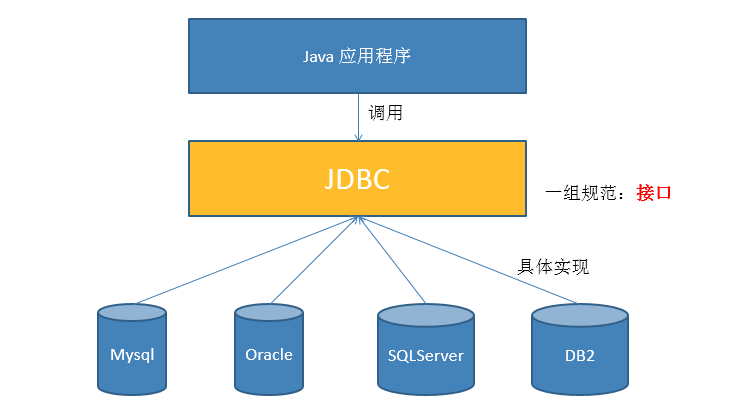
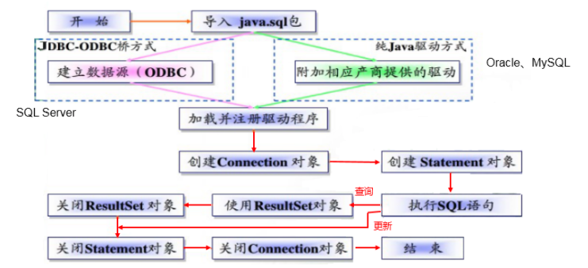
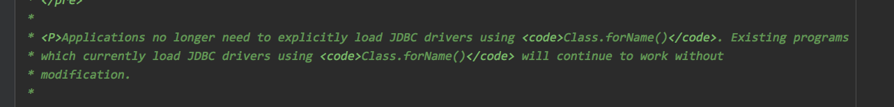
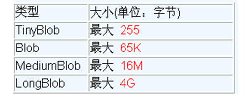

该笔记根据尚学堂*JDBC*课程的笔记修改（自己吸收理解后留下的笔记用作日后复习）

*JDBC*介绍

- *JDBC(Java Database Connectivity)*是一个**独立于特定数据库管理系统、通用的*SQL*数据库存取和操作的公共接口**（一组*AP*I），定义了用来访问数据库的标准*Java*类库，*（**java.sql,javax.sql**）*使用这些类库可以以一种**标准**的方法、方便地访问数据库资源。
- *JDBC*的目标是使*Java*程序员使用*JDBC*可以连接任何**提供了JDBC驱动程序**的数据库系统，这样就使得程序员无需对特定的数据库系统的特点有过多的了解，从而大大简化和加快了开发过程。



#### *JDBC*程序编写步骤



​	需要连接数据图提供的驱动，加载驱动后获取连接开始执行后续的操作

#### 获取数据库连接

​	获取数据库连接需要的参数：*url，user，password*以及驱动。**现在版本我们已经不需要自己去连接驱动了，因为*DriverManager*或者*Driver*的静态代码块已经帮我们去加载了**。所以我们要获取前面三个参数，可以从配置文件中获取

*Jdbc.properties:* 放在*src*目录下 

```properties
user=root
password=123456
url=jdbc:mysql://localhost:3306/test
# 驱动可以不要了 com.mysql.cj.jdbc.Driver 
driverClass=com.mysql.jdbc.Driver 
```

```java
	@Test
    public  void testConnection5() throws Exception {
    	// 1.加载配置文件
        InputStream is = ConnectionTest.class.getClassLoader().getResourceAsStream("jdbc.properties");
        Properties pros = new Properties();
        pros.load(is);
        
        // 2.读取配置信息
        String user = pros.getProperty("user");
        String password = pros.getProperty("password");
        String url = pros.getProperty("url");
        // String driverClass = pros.getProperty("driverClass");

        // 3.加载驱动 现在不需要自己加载了 这边是为了走Driver的静态代码块
        // Class.forName(driverClass);

        // 4.获取连接
        Connection conn = DriverManager.getConnection(url,user,password);
        System.out.println(conn);

    }
```

以下是*DriverManager*中的注释：



##### *JDBCUtils*

​	提取连接数据库的操作，封装成*JDBCUtils*

```java
public class JDBCUtils {

    public static Connection getConnection() throws Exception {
        InputStream is = ClassLoader.getSystemResourceAsStream("jdbc.properties");
        Properties properties = new Properties();
        properties.load(is);

        String url = properties.getProperty("url");
        String user = properties.getProperty("user");
        String password = properties.getProperty("password");

        return DriverManager.getConnection(url, user, password);
    }

    public static void closed(Connection con, Statement statement) {

        try {
            if (con != null)
                con.close();
            if (statement != null)
                statement.close();
        } catch (SQLException ex) {
            ex.printStackTrace();
        }
    }

    public static void closed(Connection con, Statement statement, ResultSet set) {
        closed(con, statement);

        try {
            if (set != null)
                set.close();
        } catch (SQLException ex) {
            ex.printStackTrace();
        }
    }
}
```

#### 操作与访问数据库

##### *Statement*

使用*Statement*操作数据表存在弊端：

- 存在拼串操作，繁琐
- 存在*SQL*注入问题：*SQL* 注入是利用某些系统没有对用户输入的数据进行充分的检查，而在用户输入数据中注入非法的 *SQL* 语句段或命令*(如：SELECT user, password FROM user_table WHERE user='a' OR 1 = ' AND password = ' OR '1' = '1')* ，从而利用系统的 *SQL* 引擎完成恶意行为的做法。

##### *PreparedStatement*

- *PreparedStatement* 可以防止 *SQL* 注入 
- *DBServer*会对**预编译**语句提供性能优化。因为预编译语句有可能被重复调用，所以<u>语句在被*DBServer*的编译器编译后的执行代码被缓存下来，那么下次调用时只要是相同的预编译语句就不需要编译，只要将参数直接传入编译过的语句执行代码中就会得到执行。</u>

##### *PreparedStatement*的增删改

```java
// 通用的增、删、改操作（体现一：增、删、改 ； 体现二：针对于不同的表）
	public void update(String sql,Object ... args){
		Connection conn = null;
		PreparedStatement ps = null;
		try {
			// 1.获取数据库的连接
			conn = JDBCUtils.getConnection();
			
			//2 .获取PreparedStatement的实例 (或：预编译sql语句)
			ps = conn.prepareStatement(sql);
			//3 .填充占位符
			for(int i = 0;i < args.length;i++){
				ps.setObject(i + 1, args[i]);
			}
			
			// 4.执行sql语句
			ps.execute();
		} catch (Exception e) {
			
			e.printStackTrace();
		}finally{
			// 5.关闭资源
			JDBCUtils.closeResource(conn, ps);
			
		}
	}
```

##### *PreparedStatement*的查询

```java
// 通用的针对于不同表的查询:返回一个对象 
	public <T> T getInstance(Class<T> clazz, String sql, Object... args) {

		Connection conn = null;
		PreparedStatement ps = null;
		ResultSet rs = null;
		try {
			// 1.获取数据库连接
			conn = JDBCUtils.getConnection();

			// 2.预编译sql语句，得到PreparedStatement对象
			ps = conn.prepareStatement(sql);

			// 3.填充占位符
			for (int i = 0; i < args.length; i++) {
				ps.setObject(i + 1, args[i]);
			}

			// 4.执行executeQuery(),得到结果集：ResultSet
			rs = ps.executeQuery();

			// 5.得到结果集的元数据：ResultSetMetaData
			ResultSetMetaData rsmd = rs.getMetaData();

			// 6.1通过ResultSetMetaData得到columnCount,columnLabel；通过ResultSet得到列值
			int columnCount = rsmd.getColumnCount();
			if (rs.next()) {
				T t = clazz.newInstance();
				for (int i = 0; i < columnCount; i++) {// 遍历每一个列

					// 获取列值
					Object columnVal = rs.getObject(i + 1);
					// 获取列的别名:列的别名，使用类的属性名充当
					String columnLabel = rsmd.getColumnLabel(i + 1);
					// 6.2使用反射，给对象的相应属性赋值
					Field field = clazz.getDeclaredField(columnLabel);
					field.setAccessible(true);
					field.set(t, columnVal);

				}

				return t;

			}
		} catch (Exception e) {

			e.printStackTrace();
		} finally {
			// 7.关闭资源
			JDBCUtils.closeResource(conn, ps, rs);
		}

		return null;

	}
```

##### 关于*ResultSetMetaData*

1. **如何获取 *ResultSetMetaData***： 调用 *ResultSet* 的 *getMetaData()* 方法即可
2. **获取 *ResultSet* 中有多少列**：调用 *ResultSetMetaData* 的 *getColumnCount()* 方法
3. **获取 *ResultSet* 每一列的列的别名是什么**：调用 *ResultSetMetaData* 的*getColumnLabel()* 方法

#### 操作*BLOB*类型字段

​	*MYSQL*的四种*Blob*类型，除了最大信息量不同，他们是一样的



##### 插入大数据类型

```java
// 获取连接
Connection conn = JDBCUtils.getConnection();
		
String sql = "insert into ...";
PreparedStatement ps = conn.prepareStatement(sql);

// 填充占位符
ps.setString(1, "xxx");
ps.setString(2, "xxx");
ps.setDate(3, "xxx");
// 操作Blob类型的变量
FileInputStream fis = new FileInputStream(path);
ps.setBlob(4, fis);
//执行
ps.execute();
		
fis.close();
JDBCUtils.closeResource(conn, ps);


```

##### 从数据表中读取大数据类型

```java
String sql = "SELECT xxx FROM ... WHERE id = ?";
conn = getConnection();
ps = conn.prepareStatement(sql);
ps.setInt(1, 8);
rs = ps.executeQuery();
if(rs.next()){
	Integer id = rs.getInt(1);
    // 读取Blob类型的字段
	Blob photo = rs.getBlob(5);
	InputStream is = photo.getBinaryStream();
	OutputStream os = new FileOutputStream("c.jpg");
	byte [] buffer = new byte[1024];
	int len = 0;
	while((len = is.read(buffer)) != -1){
		os.write(buffer, 0, len);
	}
    JDBCUtils.closeResource(conn, ps, rs);
		
	if(is != null){
		is.close();
	}
		
	if(os !=  null){
		os.close();
	}
    
}
```

#### 批量插入

​	*JDBC*的批量处理语句包括下面三个方法：

- ***addBatch(String)：*添加需要批量处理的*SQL*语句或是参数；**
- ***executeBatch()：*执行批量处理语句；**
- ***clearBatch():* 清空缓存的数据**

通常我们会遇到两种批量执行*SQL*语句的情况：

- 多条*SQL*语句的批量处理；
- 一个*SQL*语句的批量传参；

##### 实现

```java
/*
* 层次四：在层次三的基础上操作
* 使用Connection 的 setAutoCommit(false)  /  commit()
*/
@Test
public void testInsert2() throws Exception{
	long start = System.currentTimeMillis();
		
	Connection conn = JDBCUtils.getConnection();
		
	// 1.设置为不自动提交数据
	conn.setAutoCommit(false);
		
	String sql = "insert into goods(name)values(?)";
	PreparedStatement ps = conn.prepareStatement(sql);
		
	for(int i = 1;i <= 1000000;i++){
		ps.setString(1, "name_" + i);
			
		// 1.“攒”sql
		ps.addBatch();
			
		if(i % 500 == 0){
			// 2.执行
			ps.executeBatch();
			// 3.清空
			ps.clearBatch();
		}
	}
		
	// 2.提交数据
	conn.commit();
		
	long end = System.currentTimeMillis();
	System.out.println("花费的时间为：" + (end - start));//1000000条:4978 
		
	JDBCUtils.closeResource(conn, ps);
}
```

####  数据库事务

##### *JDBC*事务处理

数据库的自动提交有如下情况：

1. *DDL*一旦操作就会自己提交 

2. *DML*默认情况下操作就会自己提交

3. 关闭数据库连接时会自动提交

**我们应该使用一个连接来完成多个语句的操作，也就是用一个事务来执行多个*SQL*语句的操作**：

- 调用 *Connection* 对象的 ***setAutoCommit(false)*** 以取消自动提交事务
- 在所有的 *SQL* 语句都成功执行后，调用 ***commit()*** 方法提交事务
- 在出现异常时，调用 ***rollback()*** 方法回滚事务

> 若此时 Connection 没有被关闭，还可能被重复使用，则需要恢复其自动提交状态 setAutoCommit(true)。尤其是在使用数据库连接池技术时，执行close()方法前，建议恢复自动提交状态。

模拟转账

```java
public void testJDBCTransaction() {
	Connection conn = null;
	try {
		// 1.获取数据库连接
		conn = JDBCUtils.getConnection();
		// 2.开启事务
		conn.setAutoCommit(false);
		// 3.进行数据库操作
		String sql1 = "update user_table set balance = balance - 100 where user = ?";
		update(conn, sql1, "AA");

		// 模拟网络异常
		//System.out.println(10 / 0);

		String sql2 = "update user_table set balance = balance + 100 where user = ?";
		update(conn, sql2, "BB");
		// 4.若没有异常，则提交事务
		conn.commit();
	} catch (Exception e) {
		e.printStackTrace();
		// 5.若有异常，则回滚事务
		try {
			conn.rollback();
		} catch (SQLException e1) {
			e1.printStackTrace();
		}
    } finally {
        try {
			//6.恢复每次DML操作的自动提交功能
			conn.setAutoCommit(true);
		} catch (SQLException e) {
			e.printStackTrace();
		}
        //7.关闭连接
		JDBCUtils.closeResource(conn, null, null); 
    }  
}
```

其中，对数据库操作的方法为：

```java
// 使用事务以后的通用的增删改操作
public void update(Connection conn ,String sql, Object... args) {
	PreparedStatement ps = null;
	try {
		// 1.获取PreparedStatement的实例 (或：预编译sql语句)
		ps = conn.prepareStatement(sql);
		// 2.填充占位符
		for (int i = 0; i < args.length; i++) {
			ps.setObject(i + 1, args[i]);
		}
		// 3.执行sql语句
		ps.execute();
	} catch (Exception e) {
		e.printStackTrace();
	} finally {
		// 4.关闭资源
		JDBCUtils.closeResource(null, ps);
	}
}
```

